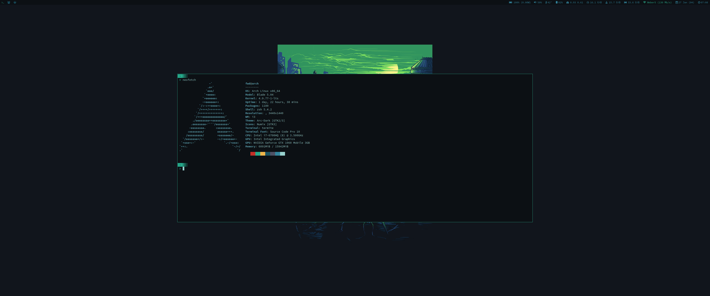

```
      ██            ██     ████ ██  ██                
     ░██           ░██    ░██░ ░░  ░██                
     ░██  ██████  ██████ ██████ ██ ░██  █████   ██████
  ██████ ██░░░░██░░░██░ ░░░██░ ░██ ░██ ██░░░██ ██░░░░ 
 ██░░░██░██   ░██  ░██    ░██  ░██ ░██░███████░░█████ 
░██  ░██░██   ░██  ░██    ░██  ░██ ░██░██░░░░  ░░░░░██
░░██████░░██████   ░░██   ░██  ░██ ███░░██████ ██████ 
 ░░░░░░  ░░░░░░     ░░    ░░   ░░ ░░░  ░░░░░░ ░░░░░░  
 
  ▓▓▓▓▓▓▓▓▓▓
 ░▓ about  ▓ custom linux config files
 ░▓ author ▓ Federico Weber <federicoweber@gmail.com>
 ░▓ code   ▓ https://github.com/federicoweber/dotfiles
 ░▓▓▓▓▓▓▓▓▓▓
 ░░░░░░░░░░

 ```

 It uses [dotbot] (https://github.com/anishathalye/dotbot) for installation.
 Just run `./install`.
 
 
